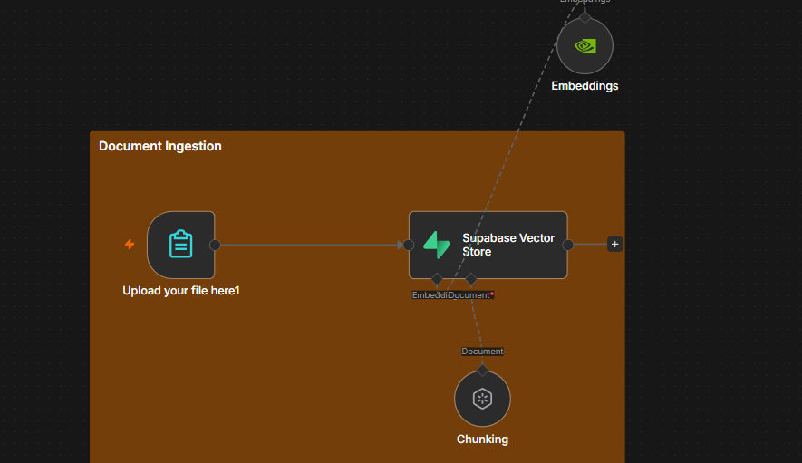
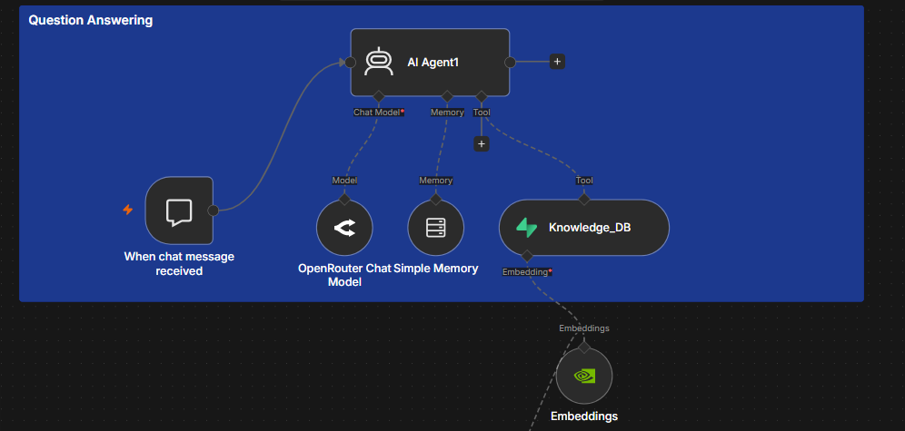

# 🤖 Usaktif — AI Academic Chatbot

**Usaktif** adalah chatbot berbasis Artificial Intelligence (AI) yang dirancang sebagai virtual customer service untuk membantu mahasiswa, calon mahasiswa, dosen, dan pengguna lainnya memperoleh informasi akademik Jurusan Sistem Informasi Universitas Trisakti.

Chatbot menggunakan pendekatan **Retrieval-Augmented Generation (RAG)** sehingga jawaban dihasilkan berdasarkan informasi yang tersedia pada knowledge base.

## 🚀 Features

* 💬 Menjawab pertanyaan akademik secara conversational
* 🔎 Retrieval informasi menggunakan Vector Database
* 📚 Knowledge base berbasis dokumen akademik
* 🧠 AI-powered response generation
* ⚙️ Workflow automation menggunakan n8n
* 🔐 Membatasi jawaban berdasarkan informasi yang tersedia pada knowledge base
* 🔄 Automated document processing dan embedding

## 🏗️ System Architecture

```text
User
  │
  ▼
Chat Interface
  │
  ▼
n8n Workflow
  │
  ├── Query Processing
  │
  ├── Text Embedding
  │
  ▼
Supabase + pgvector
  │
  ├── Similarity Search
  │
  ▼
Relevant Documents
  │
  ▼
LLM
  │
  ▼
Generated Response
  │
  ▼
User
```

## 🛠️ Tech Stack

| Technology      | Purpose                                    |
| --------------- | ------------------------------------------ |
| n8n             | Workflow automation                        |
| Supabase        | Database & vector storage                  |
| pgvector        | Vector similarity search                   |
| Embedding Model | Convert documents and queries into vectors |
| LLM             | Generate natural language responses        |
| RAG             | Retrieval-Augmented Generation             |
| Docker          | Self-hosted deployment                     |

## 🔄 Workflow

### 1. Document Ingestion

Dokumen akademik dimasukkan ke dalam workflow untuk diproses.

```text
Document
   ↓
Text Extraction
   ↓
Text Chunking
   ↓
Embedding
   ↓
Supabase Vector Database
```


### 2. Question Answering

Ketika pengguna mengirimkan pertanyaan:

```text
User Question
      ↓
Query Embedding
      ↓
Vector Similarity Search
      ↓
Relevant Context
      ↓
LLM
      ↓
Answer
```


Dengan pendekatan ini, chatbot dapat memberikan jawaban berdasarkan informasi yang terdapat pada knowledge base.

## 📊 Example Use Cases

Usaktif dapat digunakan untuk menjawab pertanyaan seperti:

* Informasi mata kuliah
* Informasi dosen
* Informasi akademik
* Informasi administrasi
* Informasi kegiatan mahasiswa
* Informasi layanan Jurusan Sistem Informasi


### Chatbot Demo

https://github.com/user-attachments/assets/920d16c6-ac01-4bfa-8c96-1bf7d052b6d2

## 🎯 Project Objective

Project ini dibuat untuk mengimplementasikan teknologi **Generative AI, RAG, Vector Database, dan workflow automation** dalam membangun sistem chatbot yang dapat membantu pengguna memperoleh informasi akademik secara lebih cepat dan interaktif.

## 👨‍💻 Author

**Fathur Rahman**

Information Systems | Data & AI Enthusiast

**Focus:** Data Analytics • Machine Learning • Generative AI • AI Automation
